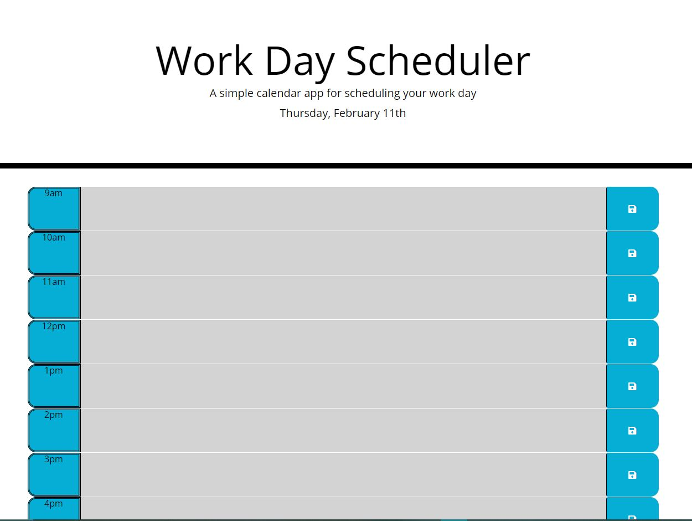

# nine2five
# Third-Party APIs: A Work Day Scheduler
​
## Table of contents

  - [General-Info](#general-info)
  - [Technologies](#technologies)
  - [Deployment](#deployment)
  - [Summary](#summary)
  - [Authors](#authors)
​
​
## General-Info
​
I created a simple calendar application that allows a user to save events for each hour of the work day. This app is browser based and was built with dynamically updated HTML and CSS using JQuery.
Each time block is color-coded to indicate whether it is in the past, present, or future.
Everything is saved to LocalStorage and and is still present after a page refresh. 
​
The API I used was Moment.js
- [Moment.js](https://momentjs.com/)
​
## Technologies
​
Project is created with:
​
- [Moment.js](https://momentjs.com/)

## Deployment
​
[Landing page](https://mrfivefourone.github.io/nine2five/)
​

## Summary
​
- This project is a mock-up for an Employer to help their employees better mange their time.

​
## Authors
​
- Chris Hoffman

​
